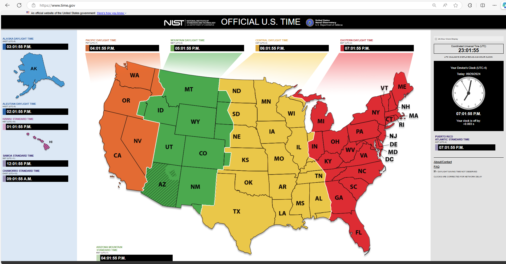
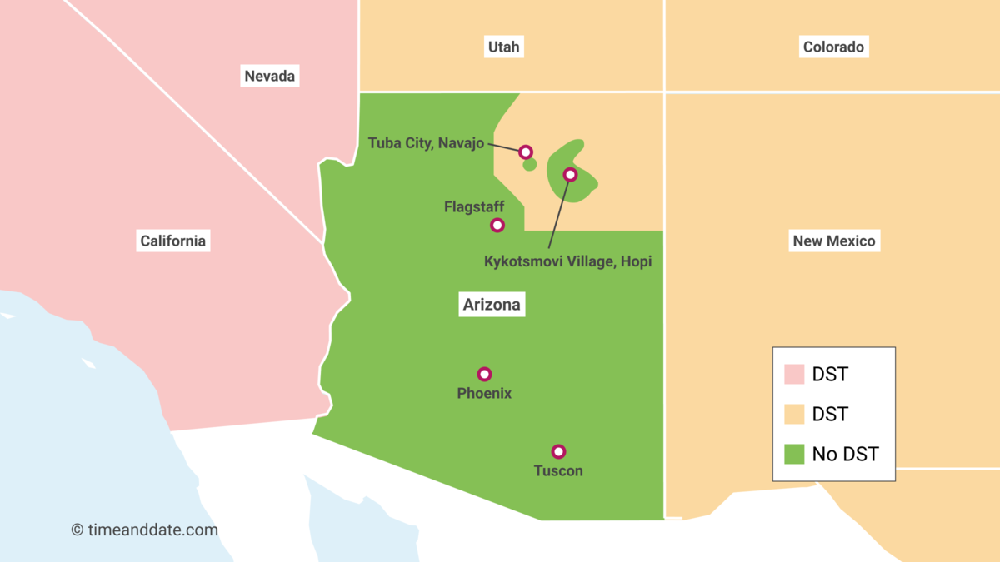

# Make a Date

**Sualeh Fatehi**

## Concepts

Let us start with some concepts

## Epoch
- Reference point to measure time
- An **epoch** marks the start of an **era**
- Divides the timeline into eras
- May be based on religious or political milestones

## Computer System Epochs
- January 1, 1601 - COBOL, Windows, .NET
- January 1, 1900 - Network Time Protocol (NTP)
- January 1, 1970 - Unix Epoch
  Linux, Mac OS X, Java, C, JavaScript, PHP, Python, Ruby

## Machine View of Time
Machines have *one* view of time:
- Discrete points corresponding to the smallest measurement possible
- A single, ever increasing number

## Instant
- Point on a discretized timeline
- .NET measures "ticks" of 100 nanoseconds in `DateTimeOffset`
- Java `Instant` has nanosecond precision
- Use for event time-stamps

## Human View of Time
Humans have a *different* view of time:
- Continuous timelines
- Calendar systems
- Arbitrary units like years, months, days, hours
- Timezones, and daylight savings rules

## Calendar System
- Organizes days for social, religious, commercial or administrative purposes
- Names periods like days, weeks, months, and years
- Periods may follow cycles of the sun or moon
- A date is a specific day in the system
- May be based on an epoch

## UTC
- UTC is Coordinated Universal Time
- Precisely defined with atomic time
- Does not change with seasons
- Replaced GMT as reference time scale in 1972
- UTC is sometimes denoted by Z (Zulu)

## Timezone
- Region with uniform standard time for legal, commercial, social, and political purposes
- Rules for daylight saving time
- Offset from UTC (UTC-12 to UTC+14)
- Includes rules for when offset changes, and historical change information

## Quiz - Question

How many timezones are in the USA?

## Quiz - Answer
11

## Crazy Timezones

## Local Date and Time
- Local date and time is missing timezone data
- Timezone may be implied:
  "Meet me on May 5 at 4 pm"

## Local Date and Time Examples
- A birthday, holiday, or employee hire date is a local date
- An daily alarm is a local time
- An meeting time or movie show time is a local date with time

## ISO 8601
- International standard for representation of dates and times
- Uses the Gregorian calendar system
- Ordered from most to least significant: year, month, day, hour, minute
- Each date and time value has a fixed number of digits with leading zeros
- Uses four-digit year at minimum, YYYY

## ISO 8601 on xkcd

## Advantages of Using ISO 8601

- **Consistency**: Ensures uniform date and time representation
- **Interoperability**: Facilitates data exchange between systems
- **Sorting and Comparison**: Simplifies ordering and comparing dates and times
- **Timezone Handling**: Supports global applications with timezone info
- **Readability**: Easy for both machines and humans to parse

## Examples of ISO 8601 Local Date and Time
- Local date: `YYYYMMDD` or `YYYY-MM-DD`
  "20240906" or "2024-09-06" for September 6, 2024
- Local Time: `HHMMSS` or `HH:MM:SS`
  "153045" or "15:30:45"
- Local Date and Time: `YYYY-MM-DDTHH:MM:SS`
  "2024-09-06T15:30:45"

## Examples of ISO 8601 Date and Time
- UTC time: `YYYY-MM-DDTHH:MM:SSZ`
  "2024-09-06T15:30:45Z" for UTC
- With Timezone Offset: `YYYY-MM-DDTHH:MM:SS±HH:MM`
  "2024-09-06T15:30:45+02:00" for 2 hours ahead of UTC

## Common Sources of Error
- Converting a local date and time into date and time (with timezone offset)
- Storing date and time (with timezone offset) into local date and time fields
- Not handling daylight savings time boundaries - 23 or 25 hours in a day
- Incorrect or incomplete parsing of date and time strings

## Slides and Code

[github.com/**sualeh/make-a-date**](https://github.com/sualeh/make-a-date)

